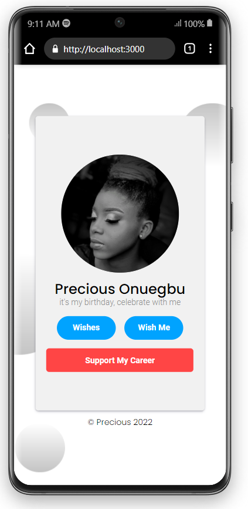

# Installation Process

- Clone the repository (https://github.com/callmefarad/celebrate-precious-frontend.git).
- Open the cloned repository with your preferred IDE.
- Launch terminal on your IDE and run the command below.
- ```npm install```
- Wait for the complete installation of npm packages required for the application to run.

## Run The App

- Enter the command below to run the app.
- npm start
- Wait until the app fires up automatically on your browser.
- Thanks for having the app right on your desktop
  
## Description

- A Birthday application for sending birthday wishes, viewing all wishes and supporting the celebrant.
- 
## Page Navigations

- Landing Page
  ```'/'```
- Wishes Page
  ```'/wishes'```
- Wish Page
  ```'/form'```
- Support Page
  ```'/career'```
  
## Mobile Sample File

- Desktop Landing Page


- Desktop Wishes Page


- Desktop Wish Page


- Desktop Support Page


## Mobile Sample File

- Desktop Landing Page


- Desktop Wishes Page


- Desktop Wish Page


- Desktop Support Page
